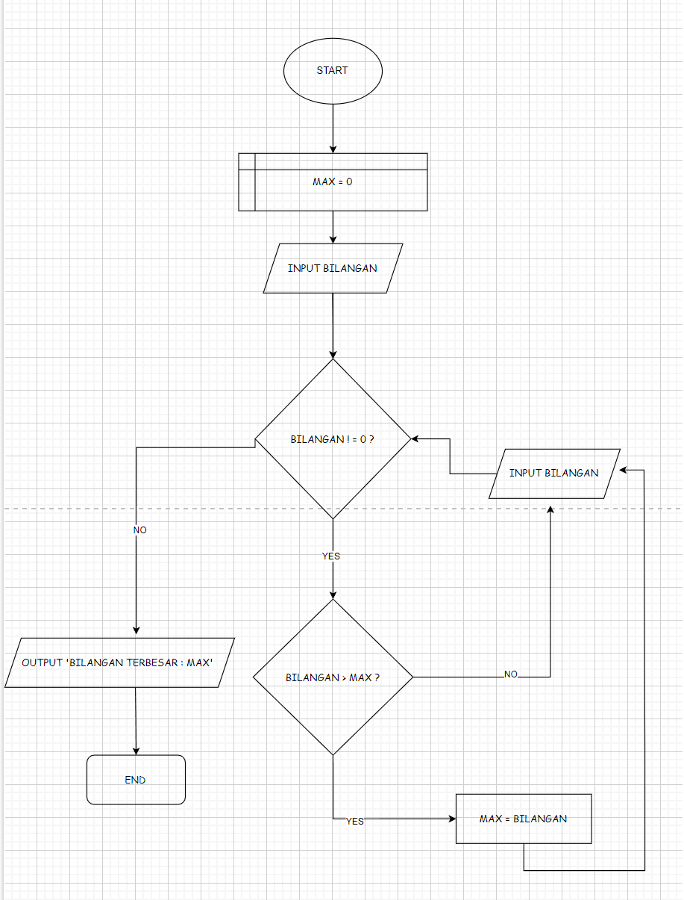

## Nama : Aldi Rismandayana
## Kelas : TI.24.A1

# 1.Program Mencari Bilangan Terbesar dari 3 Variabel
Program sederhana untuk menentukan bilangan terbesar dari tiga angka yang diinputkan pengguna.

## 1.1 Deskripsi Program
Program ini akan:

 - Meminta user memasukkan 3 bilangan berbeda
 - Membandingkan ketiga bilangan tersebut
 - Menentukan bilangan mana yang terbesar
 - Menampilkan hasilnya ke layar

# 2.Program Mencari Bilangan Terbesar
Program sederhana untuk mencari nilai terbesar dari sekumpulan bilangan yang dimasukkan oleh pengguna menggunakan loop while True dan break statement.

## 2.1 Deskripsi Program
Program ini dibuat menggunakan bahasa Python dengan fitur:

- Menggunakan while True untuk perulangan tak terbatas
- Menggunakan break statement untuk menghentikan program
- Membandingkan setiap input dengan nilai maksimum yang tersimpan
- Menampilkan bilangan terbesar yang ditemukan

   ## Flowchart Program 1
 
  ## Flowchart Program 2
 
 
 ## Kode Programan 1
```python
a = int(input ("masukan angka: "))
b = int(input ("masukan angka: "))
c = int(input ("masukan angka: "))


if a > b:
    if a > c:
        terbesar = a
    else:
        terbesar = c
else:
    if b > c:
        terbesar = b
    else:
        terbesar = c 

print (f"Bilangan Terbesar adalah {terbesar}")
```

 ## Kode Programan 2 
```python
max = 0
bilangan = int(input("masukan bilangan :"))
while bilangan != 0 :
    if bilangan > max :
        max = bilangan
    bilangan = int(input("masukan bilangan :"))

print (f"bilangan terbesar= {max}")
```

## Contoh Output 1
````mardown
Masukkan bilangan A: 89
Masukkan bilangan B: 90
Masukkan bilangan C: 200
Terbesar adalah C
````

## Contoh Output 2
````markdown
masukan bilangan :200
masukan bilangan :500
masukan bilangan :8999
masukan bilangan :1324
masukan bilangan :0
bilangan terbesar= 8999
````

## Cara Kerja Program 1 
Program ini dimulai dengan meminta pengguna untuk memasukkan tiga angka. Setelah angka-angka tersebut dimasukkan, program menggunakan fungsi max() untuk menentukan angka yang paling besar di antara ketiga angka tersebut. Fungsi max()  secara otomatis membandingkan semua angka dan mengembalikan yang terbesar. Setelah menemukan angka terbesar, program menampilkan hasilnya kepada pengguna dengan kalimat yang jelas. Dengan cara ini, kode menjadi lebih ringkas dan mudah dibaca, tanpa perlu membuat banyak kondisi untuk perbandingan.
- Apakah A > B?
- Jika ya: cek apakah A > C?
- Jika ya: A adalah terbesar
- Jika tidak: C adalah terbesar
- Jika tidak: cek apakah B > C?
- Jika ya: B adalah terbesar
- Jika tidak: C adalah terbesar

## Cara Kerja Program 2
variable max di isi dengan nilai 0, setelah itu terdapat variable inputan dengan nama bilangan, jika kondisi bilangan tidak sama dengan 0 maka cari bilangan lebih dari max dan variable max di set dengan bilangan tersebut. Jika bilangan lebih kecil dari max maka bilangan input kembali sehingga akan menghasilkan bilangan terbesar dari operasi tersebut.

